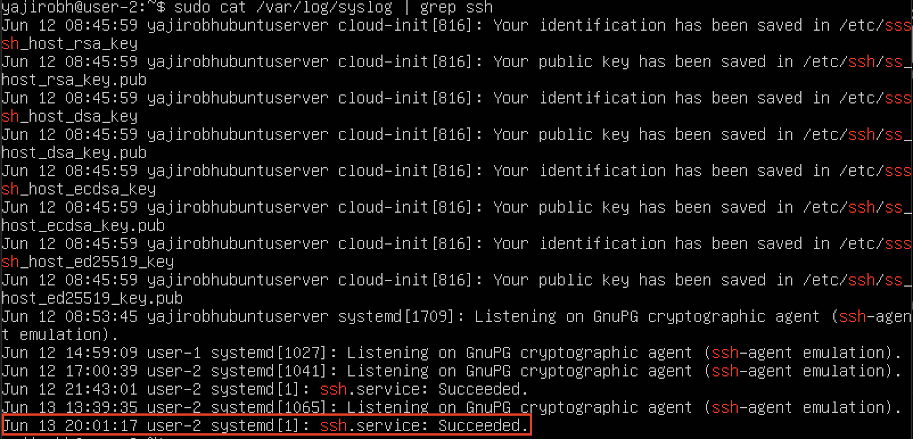

# **ОТЧЁТ**

## **Part 1. Установка ОС**
- Версия Ubuntu:\

## **Part 2. Создание пользователя**
- Создание пользователя:\

- Вывод после создания:\

## **Part 3. Настройка сети ОС**
### **Пункт 1**
- Изменение имени машины:
	- Открываем файл через `sudo vim /etc/hostname` и задаём имя:\
	
	- Сохраняем через `:wq`
- Проверка, что имя машины изменено:\

### **Пункт 2**
- Установка временной зоны - `timedatectl set-timezone Europe/Moscow`
- Проверка, что временная зона изменена:\

### **Пункт 3**
- Вывод названия сетевых интерфейсов:\

- `lo (loopback device)` – виртуальный интерфейс, присутствующий по умолчанию в любом Linux. Он используется для отладки сетевых программ и запуска серверных приложений на локальной машине. С этим интерфейсом всегда связан адрес 127.0.0.1.

### **Пункт 4**
- Получение ip-адреса от DHCP сервера:\

- `DHCP (Dynamic Host Configuration Protocol)` — сетевой протокол, позволяющий сетевым устройствам автоматически получать IP-адрес и другие параметры, необходимые для работы в сети TCP/IP. Данный протокол работает по модели «клиент-сервер». DHCP является расширением протокола BOOTP, использовавшегося ранее для обеспечения бездисковых рабочих станций IP-адресами при их загрузке. DHCP сохраняет обратную совместимость с BOOTP и, как и BOOTP, использует порт UDP/67 на стороне сервера и порт UDP/68 на стороне клиента.

### **Пункт 5**
- Получение внешнего ip-адреса шлюза (ip):\

- Получение внутреннего ip-адреса шлюза (gw):\

### **Пункт 6**
- Установка статичных настроек ip, gw, dns:
	- Открываем файл через `sudo vim ../../etc/netplan/00-installer-config.yaml` и добавляем необходимые настройки:\
	
	- Сохраняем через `:wq`
- Применение и проверка:\
\
\

### **Пункт 7**
- Перезагрузка - `reboot`
- Проверка, что изменения сохранены:\

- Пинг 1.1.1.1:\

- Пинг ya.ru:\

## **Part 4. Обновление ОС**
- Получение обновления - `sudo apt-get upgrade`
- Проверка, что обновления установлены:\

## **Part 5. Использование команды sudo**
- `sudo (substitute user and do)` позволяет строго определенным пользователям выполнять указанные программы с административными привилегиями без ввода пароля суперпользователя root. Команда sudo позволяет выполнять программы от имени любого пользователя, но, если идентификатор или имя этого пользователя не указаны, то предполагается выполнение от имени суперпользователя root. Таким образом, использование sudo позволяет выполнять привилегированные команды обычным пользователям без необходимости ввода пароля суперпользователя root. 
- Предоставление прав пользователю - `sudo usermod -a -G sudo user1`
- Проверка, что права предоставлены:
	- до:\
	
	- после:\
	
- Смена пользователя:\

- Текущий hostname:\

- Меняем hostname:
	- Открываем файл через `sudo vim /etc/hostname` и пишем новый hostname:\
	
	- Сохраняем через `:wq`
- Проверяем новый hostname:\

## **Part 6. Установка и настройка службы времени**
- Вывод текущего времени и часового пояса:\

- Изменение серверов для синхронизации:
	- Открываем файл через `sudo vim /etc/ntp.conf` и меняем `ubuntu` на `ru`:\
	
	- Сохраняем через `:wq`
- Проверка синхронизации:\

## **Part 7. Установка и использование текстовых редакторов**
### **Пункт 1: Установка текстовых редакторов:**
### **VIM**
Устанавливаем vim через `sudo apt install vim` и проверяем, что редактор установлен:\

### **NANO**
Устанавливаем nano через `sudo apt install nano` и проверяем, что редактор установлен:\

### **MCEDIT**
Устанавливаем mcedit через `sudo apt install mcedit` и проверяем, что редактор установлен:\

### **Пункт 2: Редактирование с сохранением изменений:**
### **VIM**
- Открыть файл через `vim test_vim.txt`, нажать `i`, напечатать необходимый текст:\

- Выйти через `esc+:wq`
- Проверяем, что изменения сохранены:\
`vim test_vim.txt`\

### **NANO**
- Открыть файл через `nano test_nano.txt`, напечатать необходимый текст:\

- Сохранить через `ctrl+o` (при необходимости задать имя файлу):\

- Выйти через `ctrl+x`
- Проверяем, что изменения сохранены:\
`nano test_nano.txt`\

### **MCEDIT**
- Открыть файл через `mcedit test_mcedit.txt`, напечатать необходимый текст:\

- Сохранить через `fn+f2`, подтвердить сохранение - `save + enter`:\

- Выйти через `fn+f10`
- Проверяем, что изменения сохранены:\
`mcedit test_mcedit.txt`\

### **Пункт 3: Редактирование без сохранения изменений:**
### **VIM**
- Открыть файл через `vim test_vim.txt`, нажать `i`, напечатать необходимый текст:\

- Проверяем, что изменения не сохранены:\
`vim test_vim.txt`\

### **NANO**
- Открыть файл через `nano test_nano.txt`, напечатать необходимый текст:\

- Выйти через `ctrl+x`, затем - `n`:\

- Проверяем, что изменения не сохранены:\
`nano test_nano.txt`\

### **MCEDIT**
- Открыть файл через `mcedit test_mcedit.txt`, напечатать необходимый текст:\

- Выйти через `fn+f10`, подтвердить выход без сохранения - `no + enter`:\

- Проверяем, что изменения не сохранены:\
`mcedit test_mcedit.txt`\

### **Пункт 4: Поиск слова и замена:**
### **VIM**
- Открыть файл через `vim test_vim.txt`
- Поиск: нажать клавишу `/`, напечатать текст для поиска, нажать `enter`:\

- Замена: напечатать `:s + / + текст для поиска + / + текст для замены`, нажать `enter`:\

- Результат:\

### **NANO**
- Открыть файл через `nano test_nano.txt`
- Поиск: `ctrl + /`, напечатать текст для поиска, нажать `enter`:\

- Результат:\

- Замена: напечатать `ctrl + / + текст для поиска` + `enter + текст для замены`, нажать `enter`, подтвердить:\
\
\

- Результат:\

### **MCEDIT**
- Открыть файл через `mcedit test_mcedit.txt`
- Поиск: напечатать `fn+f7`, напечатать текст для поиска, нажать `enter`:\

- Результат:\

- Замена: напечатать `fn+f4`, напечатать текст для поиска, текст для замены, нажать `enter`, подтвердить:\
\

- Результат:\

## **Part 8. Установка и базовая настройка сервиса SSHD**
### **Пункт 1**
- Установка службы `sshd`:
	- Устанавливаем `ssh` - `sudo apt-get install ssh`
	- Устанавливаем `openssh` - `sudo apt-get install openssh-server`
- Проверяем работу `ssh`:\

### **Пункт 2**
- Автостарт службы при загрузке системы:\

### **Пункт 3**
- Перенастройка службы `sshd` на порт 2022:
	- Открыть файл через `mcedit test_mcedit.txt`, поменять `#Port 22` на `Port 2022`:\
	
	- Сохраняем через `:wq`
- Перезапускаем сервер - `/etc/init.d/ssh restart`
- Проверяем:\

- Команда `netstat` показывает содержимое различных структур данных, связанных с активными сетевыми соединениями.\
`-tan:`\
`-t` - перечисление всех портов TCP\
`-a` - перечисление всех портов TCP и UDP\
`-n` - показывать сетевые адреса как числа (обычно показывает адреса как символы)\
- **Столбцы вывода:**\
`Proto` - имя протокола (TCP или UDP)\
`Recv-Q` - количество полученных, но ещё не обработанных данных\
`Send-Q` - количество данных, которые готовы к отправке, но ещё не отправлены\
`Local Address` - локальный IP-адрес и номер используемого порта\
`Foreign Address` - удалённый IP-адрес и номер используемого порта\
`State` - состояние TCP-подключения:
	- `CLOSED` - не используется
	- `LISTEN (LISTENING)` - ожидает входящих соединений
	- `SYN_SENT` - активно пытается установить соединение
	- `SYN_RECEIVED` - идёт начальная синхронизация соединения
	- `ESTABLISHED` - соединение установлено
	- `CLOSE_WAIT` - удалённая сторона отключилась; ожидание закрытия сокета
	- `FIN_WAIT_1` - сокет закрыт; отключение соединения
	- `CLOSING` - сокет закрыт, затем удаленная сторона отключилась; ожидание подтверждения
	- `LAST_ACK` - удаленная сторона отключилась, затем сокет закрыт; ожидание подтверждения
	- `FIN_WAIT_2` - сокет закрыт; ожидание отключения удаленной стороны
	- `TIME_WAIT` - сокет закрыт, но ожидает пакеты, ещё находящиеся в сети для обработки
- `0.0.0.0` означает "любой адрес", т.е в соединении могут использоваться все IP-адреса существующие на данном компьютере

### **Пункт 4**
- Проверка наличия процесса `sshd` командой `ps`:\

- Команда `ps` выводит список текущих процессов на сервере. Ключи ps помогают выбрать нужные процессы для отображения их состояний. Вот список опций выбора процессов для отображения:\
`-A`, `-e` - выбрать все процессы\
`-a` - выбрать все процессы, кроме фоновых\
`-d` - выбрать все процессы, даже фоновые, кроме процессов сессий\
`-N` - выбрать все процессы кроме указанных\
`-С` - выбирать процессы по имени команды\
`-G` - выбрать процессы по ID группы\
`-p` - выбрать процессы PID\
`--ppid` - выбрать процессы по PID родительского процесса\
`-s` - выбрать процессы по ID сессии\
`-t` - выбрать процессы по tty\
`-u` - выбрать процессы пользователя\
Утилита `grep` помогает фильтровать результаты вывода команды `ps`, в нашем случае, чтобы вывести строки содержащие ключевое слово `sshd`.

### **Пункт 5**
- Перезагрузка системы - `reboot`

## **Part 9. Установка и использование утилит top, htop**
### **top**
- Устанавливаем **top** - `sudo apt install top`
- Запуск утилиты - `top`
- **Вывод:**\

	- uptime - `2 ч. 12 мин.`
	- количество авторизованных пользователей - `1`
	- общая загрузка системы - `0,00, 0,00, 0,00`
	- общее количество процессов - `111`
	- загрузка cpu - `0,0 us, 0,0 sy, 0,0 ni,100,0 id, 0,0 wa, 0,0 hi, 0,0 si, 0.0 st`
	- загрузка памяти: 
		- Mem - `4922,0 total, 3311,1 free, 175,1 used, 1435,9 buff/cache`
		- Swap - `0,0 total, 0,0 free, 0,0 used. 4469,2 avail Mem`
	- pid процесса занимающего больше всего памяти - `1`
	- pid процесса, занимающего больше всего процессорного времени - `12568`
### **htop**
- Устанавливаем **htop** - `sudo apt install htop`
- Запуск утилиты - `htop`
- **Вывод:**\

- **Сортировка:**\
`f6` + в появившемся окне выбрать параметр сортировки:\

	- PID:\
	
	- PERCENT_CPU:\
	
	- PERCENT_MEM:\
	
	- TIME:\
	
- **Фильтр для sshd:**\
`fn+f4` + печатаем название нужного процесса (sshd):\

- **Поиск процесса syslog:**\
`fn+f3` + печатаем название нужного процесса (syslog):\

- **Фильтр для sshd:**\
`fn+f2` + выбираем нужные параметры вывода (hostname, clock и uptime) + `fn+f10`:\
\

## **Part 10. Использование утилиты fdisk**
- Печатаем `sudo fdisk -l`
- Вывод:\

	- Название диска - `/dev/sda`
	- Размер - `10 GiB`
	- Количество секторов - `20971520`
	- swap - `отсутствует`

## **Part 11. Использование утилиты df**
### df
- Вывод:\

	- Размер раздела - `8408452 кб`
	- Размер занятого пространства - `3146104 кб`
	- Размер свободного пространства - `4813632 кб`
	- Процент использования - `40%`
- Единица измерения - `кбайт`
### df -Th
- Вывод:\

	- Размер раздела - `8,1G`
	- Размер занятого пространства - `3,1G`
	- Размер свободного пространства - `4,6G`
	- Процент использования - `40%`
- Тип файловой системы - `ext4` (журналируемая файловая система, используемая преимущественно в операционных системах с ядром Linux)

## **Part 12. Использование утилиты du**
- Использование: `sudo du -h <путь к папке>`. Опция `-h` выводит информацию в единицах измерения, удобных для человека. Опция `-s` выводит только общий размер. Опция `-a` выводит размер для всех файлов, по умолчанию размер выводится только для папок
- Вывод:
	- `/home`:\
	
	- Общий размер `/home`:\
	
	- `/var`:\
	
	- Общий размер `/var`:\
	
	- `/var/log`:\
	
	- Общий размер `/var/log`:\
	
- Вывод всего содержимого в /var/log - `sudo du -ha /var/log *`:\
	

## **Part 13. Установка и использование утилиты ncdu**
- Устанавливаем `ncdu` через `sudo apt-get install ncdu`
- Проверяем, что `ncdu` установлен:\

- Вывод - `sudo ncdu <путь к папке>`:
	- `/home`:\
	
	- `/var`:\
	
	- `/var/log`:\
	

## **Part 14. Работа с системными журналами**
- Открытие `/var/log/dmesg` для просмотра - `sudo vim /var/log/dmesg`:\

- Открытие `/var/log/syslog` для просмотра - `sudo vim /var/log/syslog`:\

- Открытие `/var/log/auth.log` для просмотра - `sudo vim /var/log/auth.log`:\

- Для просмотра времени последней авторизации, имени пользователя и метода входа в систему - `last`:\

	- Время последней авторизации - `Wed Jun 12 11:45:53 2024`
	- Имя пользователя - `yajirobh`
	- Метод входа в систему -  `tty1`
- Перезапускаем sshd - `/etc/init.d/ssh restart`
- Ищем в `/var/log/syslog` сообщение о последнем рестарте:\

## **Part 15. Использование планировщика заданий CRON**
- Устанавливаем `CRON` через `sudo apt install cron`
- Проверяем, что `CRON` установлен:\

- Заводим задачу командой `crontab -e`. Выбираем редактор (в нашем случае `vim`). Редактор выбирается при первом запуске, затем по умолчанию планировщик открывается только в этом редакторе. Через `vim` добавляем в планировщик `*/2 * * * * uptime`:\

- Сохраняем через `:wq`
- Смотрим текущие задачи командой `crontab -l`:\

- Командой `sudo grep uptime /var/log/syslog` проверяем в `/var/log/syslog` выполнение нашей задачи:\

- Удаляем задачи командой `crontab -r` и командой `crontab -l` проверяем, что нет установленных задач:\

